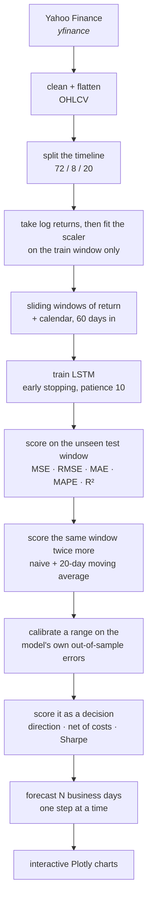
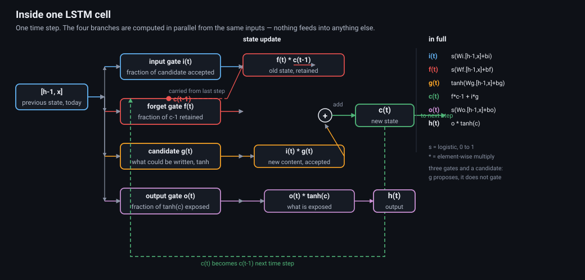
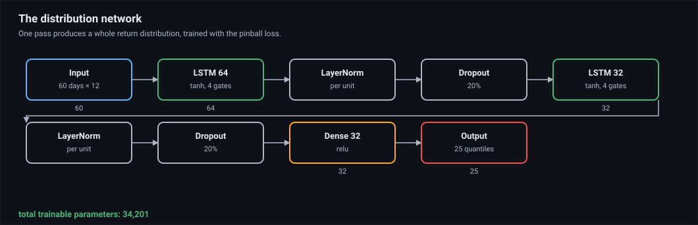
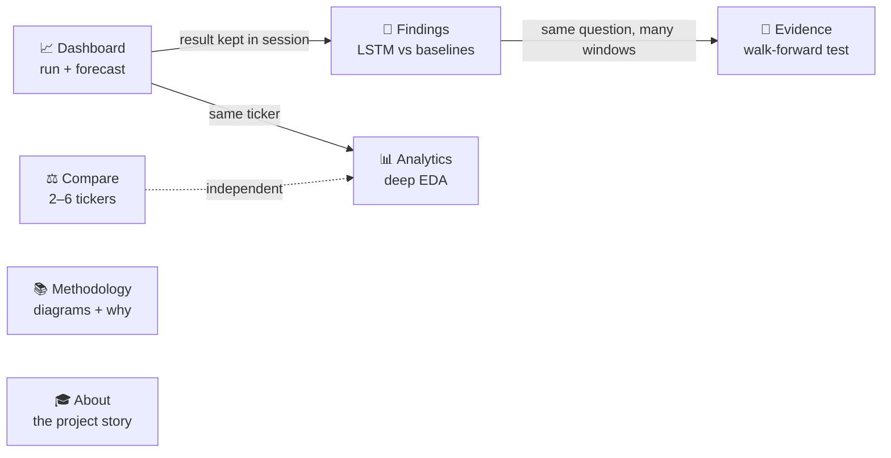
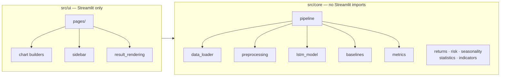

# LSTM Trend

A Streamlit app that downloads a stock's history, trains a small LSTM on it, and
forecasts the next few business days — then scores itself honestly against the
simplest guess available: yesterday's price.

**Live app:** <https://lstm-trend.streamlit.app>

Three things this project is actually about:

1. **A measured negative result.** Over 20 tickers and 300 walk-forward windows,
   no model beat "repeat yesterday". That is the finding, and the app is built to
   demonstrate it rather than argue around it. See
   [what was measured](#what-was-measured).
2. **Calibrated uncertainty that works.** A 90% forecast range contains the
   outcome about 90% of the time, and the coverage is printed next to the range
   so you can check it rather than trust it.
3. **Scoring that survives contact with a decision.** Direction, the return of
   a long/flat rule after costs, and its Sharpe — not just "was the price
   closer", which a market where nothing is predictable can win by luck.

A learning project, not a trading tool. The [limits](#limits) section is not
optional reading.

---

## What it does



You pick a ticker and a range, press **Run analysis**, and get back a market
snapshot, training curves, the test-window fit, a calibrated forecast range with
its realised coverage, a forecast table you can download, and the same numbers
for both baselines.

---

## The model

This section goes from "it is a neural network" down to the arithmetic inside a
single neuron, because the interesting part of this project is not that an LSTM
failed to beat yesterday's price — it is understanding *why*, at the level of
gates and weight matrices.

### One timeline, three windows

<p align="center">
  
</p>

The test window is data the model never trained on, which is the only reason
the RMSE on the Findings page means anything. The same rule holds for the
scaling: the `MinMaxScaler` is fit on the training slice only, so the test
window's extremes never shape the values the model learns from. Leaking the test
window into the scaler is the quietest way to make a useless model look
excellent, and it is why `preprocessing.fit_scaler` takes the training slice as
an argument rather than a full series.

### Inside one cell — the neuron-level view

<p align="center">
  
</p>

An LSTM unit is not one neuron. It is **four** — an input gate, a forget gate,
a candidate, and an output gate — plus a memory line that runs straight through.
That is where the "×4" in the parameter arithmetic below comes from.

Read it as a filing decision. The **forget gate** decides which existing memories
to drop. The **input gate** decides how much of what is arriving to accept. The
**candidate** proposes what could be written. The **output gate** decides how
much of the updated memory to expose downstream. Every gate outputs a number
between 0 and 1 via a logistic function, so it is a *soft* switch — "mostly
forget", not "forget".

The three things that matter for a forecasting model:

- **Gates are computed in parallel, not in series.** The vertical stacking in the
  diagram is for reading. There is no dependency between the four gates; they all
  read the same previous hidden state and the same input.
- **The memory line `c` bypasses everything.** It flows from the previous step
  straight to the next, un-gated. This is why an LSTM can hold information over
  60 steps while a plain feed-forward network of the same depth cannot.
- **Layer normalisation after each recurrent layer** rescales each unit's
  activations to zero mean and unit variance. Without it, activations either
  saturate (all gates stuck at 0 or 1, so nothing is learned) or explode. This
  was the single change that made training stable on sequences.

### The dashboard network, layer by layer

<p align="center">
  
</p>

| Stage | Shape | What it does | Parameters |
| --- | --- | --- | --- |
| Input | 60 × 5 | 60 business days, 5 numbers each | — |
| LSTM 100 | 100 units | reads the window, writes a 100-number summary | 42,400 |
| LayerNorm | 100 | rescales each unit's activations | 200 |
| Dropout 0.2 | 100 | randomly zeroes 20% of units while training | — |
| LSTM 50 | 50 units | condenses 100 units into 50 | 30,200 |
| LayerNorm | 50 | again | 100 |
| Dropout 0.2 | 50 | again | — |
| Dense 25 | 25 | relu, mixes the 50 units | 1,275 |
| Output | 1 | next day's log return | 26 |
| **Total** | | | **74,201** |

The arithmetic, so it is checkable:

- **One LSTM layer, per time step** = `4 × (inputs × units + units²)`. The `4` is
  the gates; the `units²` term is each unit reading every other unit's state.
  For layer 1: `4 × (5×100 + 100²)` = **34,000** multiply-accumulates.
- **Layer 2**: `4 × (100×50 + 50²)` = **22,500**.
- **Dense head**: `50×25 + 25×1` = **1,275**.
- **One 60-step window forward pass**: ≈ **3.4 million** multiply-accumulates.

That is a small model by any standard — a laptop GPU trains it in seconds. Which
matters, because it rules out the excuse that the network was too big. A 74k-
parameter model is not the reason it failed to beat a coin flip.

### The distribution network

<p align="center">
  
</p>

The same trunk, smaller, with a **25-way output head** instead of one output.
Trained on the pinball loss rather than mean absolute error, so each head learns
one conditional quantile: the 1st percentile, the 5th, … the 99th.

| Model | Input | Trunk | Head | Parameters |
| --- | --- | --- | --- | --- |
| Dashboard | 60 × 5 | LSTM 100 → 50 | 1 value | 74,201 |
| Walk-forward challenger | 60 × 12 | LSTM 64 → 32 | 1 value | 33,171 |
| Distribution | 60 × 12 | LSTM 64 → 32 | **25 quantiles** | 34,201 |

The distribution model has only 1,030 more parameters than the point model, and
buys an entire conditional distribution. That is the cheapest capability in the
project by a wide margin.

### What each input column is

| Set | Width | Columns | Knowable in advance? |
| --- | --- | --- | --- |
| Dashboard | 5 | log return + 4 cyclic calendar (weekday, month) | **yes** — a date is known |
| Challenger | 12 | 4 returns, 2 volatilities, 2 moving-average distances, RSI, volume ratio, weekday, month | no |
| + OHLCV | 18 | adds gap, range, close position, Parkinson and Garman-Klass volatility, volume trend | no |
| + market context | 29 | adds VIX level/trend/change, market return and volatility, short rate, sector ETF | partly |

The rule is simple and is enforced by a test: **nothing that depends on a future
price may enter the input.** A 60-day volatility at day *t+3* needs a close at
*t+3*, which does not exist when you are forecasting. That is why the dashboard
uses only the return and the calendar — five columns is all that survives the
rule — and why the walk-forward challengers can use twelve, because they predict
the whole horizon in one pass and never need a future value as an input.

The OHLCV and market-context sets are implemented and wired to toggles, both
because they are genuinely interesting and because **measuring them is the
result**: neither helped. That is covered under
[what was measured](#what-was-measured).

### Why the target is a return and not a price

The model predicts `log(close[t+1] / close[t])`, never `close[t+1]`. Two
reasons, and the second is the important one:

1. **Prices are not stationary.** They carry a unit root — this app's own
   Dickey-Fuller test reports it on the Analytics page. A model asked to
   reproduce a non-stationary level chases a moving target and spends its
   capacity on the trend instead of the increment.
2. **The optimal point forecast is approximately zero.** For a return series
   whose conditional mean is near zero, mean-absolute-error loss is minimised by
   predicting zero — which is exactly the naive guess. This is *why* the point
   forecaster sits at −15%: it is adding variance to an already-optimal
   baseline. No amount of architecture fixes that, which is why the project's
   remaining effort went into calibrated ranges and decision metrics instead.

### Why the forecast is drawn recursively

<p align="center">
  
</p>

To get day *H*, the model predicts day 1, appends that prediction to the window,
drops the oldest day, and predicts again — five times for a five-day forecast.
Only the return and the calendar are carried forward, because they are the only
columns knowable without a future price.

This is the standard approach and it is also the app's weakest number: measured
directly, the recursive path scores **−407%** against naive versus −34.8% for a
single direct pass. Error compounds because every step's mistake becomes the next
step's input. It is kept because a user asking "what is this stock doing next
week" wants a path, and because now the app *knows* the cost of giving them one.

---

## Pages



| Page | What you get |
| --- | --- |
| 📈 **Dashboard** | Run an analysis. Calibrated forecast range with realised coverage, training curves, test-window fit, CSV download |
| 📊 **Analytics** | Five lazy tabs: Overview, Returns, Seasonality, Technicals, Risk — stationarity test, seasonality, drawdown events |
| ⚖️ **Compare** | 2–6 tickers: normalized prices, correlation, drawdowns, risk-vs-return, full metrics table |
| 🔬 **Findings** | One test window scored against the baselines, with skill against naive and a pointer to Evidence |
| 🧪 **Evidence** | The verdict you can trust: walk-forward windows pooled across tickers, a panel model, calibrated bands, a decision table after costs, and the forward record |
| 📚 **Methodology** | Pipeline and architecture diagrams, hyperparameters, design trade-offs |
| 🎓 **About** | What the project found, FAQ, run instructions |

The three pages that matter are **Evidence** (many windows, the only test with
enough power to conclude anything), **Dashboard** (one analysis, with a
calibrated range), and **Findings** (the same numbers for whatever you last ran).
Analytics and Compare are descriptive — they tell you about the data, not about
the model.

---

## Tech stack

| Piece | Version | Role |
| --- | --- | --- |
| Python | 3.13 | Language |
| Streamlit | 1.61.1 | Web app framework and multipage navigation |
| Keras | 3.15.1 | Model definition and training (Functional API) |
| PyTorch | 2.14.0+cu126 | Backend — CUDA GPU when installed from the PyTorch index, CPU otherwise |
| LightGBM | 4.7.0 | Tabular challenger model in the walk-forward test |
| pandas | 3.0.5 | Time series wrangling |
| NumPy | 2.5.1 | Array maths, windowed sequence building |
| scikit-learn | 1.9.0 | MinMaxScaler and the regression metrics |
| scipy | 1.18.0 | KDE, Q–Q plots, skew and kurtosis |
| Plotly | 6.9.0 | Every interactive chart |
| yfinance | 1.5.2 | Market data |
| pytest | 9.1.1 | Test suite — dev group only, not installed in production |
| uv | latest | Environment and dependency management |

`pyproject.toml` sets a minimum version for each dependency; `uv.lock` pins the
exact set that gets installed. Both are generated from the same list, so the
table above and the lock never disagree.

---

## Architecture

Two layers, one direction of dependency:



`src/core/` has no Streamlit import anywhere, so the analysis logic can be run
and reasoned about on its own. A few patterns worth knowing:

- **Session state carries the result.** `AnalysisResult` lands in
  `st.session_state["analysis"]`, so Findings reads it without retraining.
- **Progress via plain callables.** `ProgressReporterCallback` takes two
  callbacks and knows nothing about Streamlit; `sidebar.py` maps them onto a
  progress bar.
- **Settings are form-gated.** Lookback, horizon, epochs and batch size only
  apply once you press **Apply model settings**. Date pickers apply instantly.
- **Lazy tabs.** Analytics computes a tab when you open it, not before.
- **Cached downloads.** `load_data_cached()` is `st.cache_data(ttl=3600)`, one
  hour, to stay friendly to Yahoo Finance.
- **Device detection.** `training_device()` reports `GPU (<name>)` when
  `torch.cuda.is_available()` and `CPU` otherwise, via `lru_cache`. It reads
  the truth from the installed wheel — if that wheel is the CPU build, it says
  CPU. See the GPU section below.
- **A quiet startup, earned rather than muted.** One third-party log line
  (`triton not found`, from a Linux-only profiling utility this app never calls)
  is silenced at its logger, by name. Nothing else is suppressed: a full
  analysis logs zero warnings. `tests/test_no_third_party_warnings.py` asserts
  this stays true and includes a control proving the `torch.jit.script_method`
  warning is still reachable through `torch.utils.mkldnn.to_mkldnn` — so the
  test would fail if the warning started appearing for real rather than being
  quietly filtered.

---

## Project layout

```
lstm-trend/
├── streamlit_app.py        # entry point: KERAS_BACKEND, st.navigation, footer
├── src/
│   ├── constants.py        # defaults, URLs, plot palette
│   ├── core/               # pure analysis — no Streamlit
│   │   ├── data_loader.py  # yfinance download, MultiIndex flattening
│   │   ├── preprocessing.py# log returns, scaler fit on train only, return windows
│   │   ├── lstm_model.py   # build, train, evaluate, step-wise forecast
│   │   ├── callbacks.py    # callable-based progress reporting
│   │   ├── pipeline.py     # run_analysis(), AnalysisResult, PipelineError
│   │   ├── baselines.py    # naive + moving-average forecasts
│   │   ├── metrics.py      # MSE / RMSE / MAE / MAPE / R²
│   │   ├── intervals.py    # split-conformal bands + coverage check
│   │   ├── journal.py      # forecast journal: record, settle, score
│   │   ├── features.py     # trailing-only features for the challenger models
│   │   ├── market_context.py  # VIX, broad market, short rate, sector ETF
│   │   ├── skill.py        # skill vs naive, sign test, plain-language verdict
│   │   ├── backtest.py     # walk_forward() across rolling origins
│   │   ├── returns.py      # returns, CAGR, trailing periods, 52w position
│   │   ├── risk.py         # Sharpe, Sortino, drawdowns, VaR, CVaR
│   │   ├── seasonality.py  # weekday effects, monthly heatmap, month effects
│   │   ├── statistics.py   # skew/kurtosis, Dickey-Fuller test, autocorrelation
│   │   ├── indicators.py   # SMA, EMA, RSI, MACD, Bollinger, crossovers
│   │   ├── decision.py     # skill-after-costs, direction, calibration scoring
│   │   ├── quantile_model.py  # multi-quantile LSTM, pinball loss, coverage
│   │   ├── cross_sectional.py # long/short ranking against a random control
│   │   └── recursive_path.py  # the dashboard's own forecast, finally scored
│   └── ui/                 # Streamlit rendering
│       ├── chart_theme.py  # DARK_THEME, PALETTE, layout(), with_alpha()
│       ├── dashboard_charts.py
│       ├── analytics_charts.py
│       ├── compare_charts.py
│       ├── evidence_charts.py
│       ├── sidebar.py      # controls, symbol picker, progress UI
│       ├── result_rendering.py
│       └── pages/
│           ├── nav.py      # st.Page objects, the single source of routing
│           ├── dashboard.py · analytics.py · compare.py
│           └── findings.py · evidence.py · methodology.py · about.py
├── tests/                  # 134 tests; see the Tests section
├── docs/                   # the SVG figures used above
├── .streamlit/config.toml  # dark theme, widget borders, no usage stats
├── pyproject.toml          # metadata, dependencies, ty type-checker settings
├── uv.lock                 # locked versions
├── SECURITY.md             # how to report a vulnerability
├── LICENSE                 # MIT
└── README.md
```

`AGENTS.md`, `streamlitinfolinks.txt` and `knownerrors.txt` are local working
notes and are gitignored on purpose — the last one is the audit log of
type-checker diagnostics and what was done about them.

---

## Running it locally

Everything goes through [uv](https://docs.astral.sh/uv/) — no `pip`, no
`conda`, no global installs.

```bash
git clone git@github.com:c0k0n/lstm-trend.git
cd lstm-trend
uv sync
uv run streamlit run streamlit_app.py
```

Then open <http://localhost:8501>, pick a ticker, and hit **Run analysis**.

- First `uv sync` is slow — PyTorch is a big download.
- The first run trains from scratch; the progress bar keeps you company.
- You need at least `sequence_length + 10` trading days (70 by default);
  shorter ranges fail with a readable error instead of a Keras crash.
- Analytics needs 60 trading days minimum.

### After changing code

```bash
uv format
uv check
uv run pytest
```

`uv check` runs the **ty** type checker. Keras, Plotly, scipy and yfinance ship
no type stubs, so every value flowing out of them is unknown to a checker, and
strict mode flags the lot. `pyproject.toml` therefore sets:

```toml
[tool.ty.src]
include = ["src", "tests", "streamlit_app.py"]
exclude = [".venv", "**/__pycache__"]

[tool.ty.rules]
unresolved-import = "warn"
unresolved-attribute = "warn"
```

The `include` list is what makes the check mean something — scratch scripts
outside it are skipped, so a type error in a one-off analysis file would not
run up the count. The two downgraded rules are exactly the missing-stub family;
everything else, including attribute access, stays an error, so a real bug
cannot hide behind the configuration.

A `[tool.pyright]` section would be dead config: `uv check` runs ty, and ty
never reads it. An earlier version of this README described one; it was
removed when the project moved to ty.

### GPU

Keras 3 runs on the PyTorch backend, and the sidebar shows which device is in
use — `Training device: GPU (NVIDIA GeForce RTX 3050 6GB Laptop GPU)` on a
machine that has one, `CPU` where it does not. The entry point sets
`KERAS_BACKEND=torch` itself, though a value you preset wins.

**This only works if PyTorch was installed with CUDA.** PyPI's `torch` wheel for
Windows is a **CPU-only build**, so `torch.cuda.is_available()` returns False
there no matter how many NVIDIA libraries sit next to it. That is exactly why
the old `gpu` extra (a list of `nvidia-cuda-*` packages) never did anything.

So `pyproject.toml` pulls torch from PyTorch's own index instead:

```toml
[tool.uv.sources]
torch = { index = "pytorch-cu126" }

[[tool.uv.index]]
name = "pytorch-cu126"
url = "https://download.pytorch.org/whl/cu126"
explicit = true
```

`cu126` rather than `cu128` because cu128 publishes no torch 2.13.0 Windows
wheels. PyTorch bundles its own CUDA runtime, so a newer host driver (13.x here)
is fine.

Two consequences worth knowing:

- Every install now fetches the CUDA wheel, which is roughly 2.4 GB. On a
  CPU-only machine or a size-constrained deploy, point the source at
  `https://download.pytorch.org/whl/cpu` instead, or set `UV_TORCH_BACKEND=cpu`.
- The first `uv sync` after changing this is slow — allow several minutes.

---

## Deploying to Streamlit Community Cloud

Already live, deployed straight from `main`. To redo it: connect the repo at
<https://share.streamlit.io> with entrypoint `streamlit_app.py`, then open
**Advanced settings** and set Python to **3.13** — Community Cloud defaults to
3.12 and this project needs 3.13+. The first build is slow because of PyTorch.

Community Cloud prefers `uv.lock` over `pyproject.toml` and `requirements.txt`,
so the cloud installs exactly what you run locally. On the free tier the app
sleeps when idle and the next visitor waits for it to wake; that is normal.

---

## Configuration

Everything lives in the sidebar.

| Setting | What it does | Range | Default |
| --- | --- | --- | --- |
| Ticker | Symbol to analyse, or any custom one | — | `AAPL` |
| Start / End | Historical range | — | 2020 → today |
| Lookback window | Days the model sees per step | 10–120 | 60 |
| Forecast horizon | Business days ahead (preset or custom) | 5–90 | 15 |
| Epochs | Training passes | 1–100 | 50 |
| Batch size | Samples per step | 8–128 | 32 |

Fixed settings sit in `src/constants.py`: 80/20 split, 10% validation, 100 and
50 LSTM units, 25 dense units, 0.2 dropout, patience 10, seed 42, 20-day
moving-average window, and the colour palette.

Deep links work too —
`?ticker=MSFT&start=2024-01-01&end=2025-01-01&horizon=30` prefills the sidebar.
After a run the current settings are written back to the URL so you can
bookmark an exact analysis. `horizon` takes a preset (5, 15, 30) or any integer
from 5 to 90.

---

## Limits

- **Not investment advice.** Markets move on news, earnings and policy, none of
  which is in a price series. One LSTM on closing prices is a toy next to what
  professional shops run.
- **Close and calendar, nothing else.** No volume, no indicators, no
  fundamentals. Volume is excluded on purpose rather than by oversight: it is
  not knowable for a day that has not happened yet, so a model trained on it
  would look excellent in testing and fail the moment it forecast forward.
- **Forecasts drift.** Errors compound with horizon — see the cone above.
- **R² flatters trending stocks.** Easy to score well on a strong trend, brutal
  on a choppy one. That is exactly why the baselines are shown beside it.
- **Every run retrains from scratch**, and the free tier is memory-limited, so
  long lookbacks get slow. Forecasts are written to a SQLite journal, but on
  Community Cloud the filesystem is ephemeral, so treat that as a session
  ledger rather than a permanent record.
- **The stationarity test is plain Dickey-Fuller, not augmented.** No lagged
  differences, so residual serial correlation goes uncorrected. Its p-value and
  critical values both come from a seeded 5,000-draw Monte Carlo null at the
  actual sample size, so they agree with each other but carry simulation noise
  of roughly ±0.03 on the critical values.
- **The recursive forecast is the weakest thing in the app, and now it is
  measured.** Every number in "Where next" comes from a *direct* day-5
  forecast. The dashboard rolls forward one day at a time, and on identical
  windows that scores **−407%** against naive versus −34.8% direct — a gap
  that is not marginal (paired p = 0.003). If you only read one caveat, read
  this one: the chart on the Dashboard is drawn from the method that performs
  worst, and the flat line is not the worst of it.

## Tests

140 tests across 11 files, and the choice of *what* to test is the point: this
project's worst failure modes were silent, so the suite is built around them
rather than around coverage.

| File | Tests | Guards against |
| --- | --- | --- |
| `test_skill.py` | 15 | calling noise an edge; the pooled-aggregation order bug |
| `test_decision_and_quantiles.py` | 32 | a coin flip reported as skill; costs flattering a strategy; dollars reported as returns; a quantile grid with no median in it |
| `test_no_third_party_warnings.py` | 5 | a warning hidden by a filter rather than fixed |
| `test_intervals.py` | 18 | the finite-sample correction; coverage claims that do not hold |
| `test_market_context.py` | 21 | the context join ever reaching forward in time |
| `test_documented_numbers.py` | 7 | **the numbers in this file drifting from the raw data** |
| `test_features.py` | 12 | any feature reading a future price |
| `test_cross_sectional.py` | 10 | a ranking that cannot beat a random pick |
| `test_backtest.py` | 8 | a model arm that can see context it should not |
| `test_ui_logic.py` | 6 | the band cache serving a range from the wrong dataset |
| `test_docs_diagrams.py` | 6 | **a figure that renders but lies**: an arrow into the wrong box, one that stops in mid-air, ink invisible on a light theme |

Three are worth calling out:

**`test_documented_numbers.py` recomputes this README.** Every skill, win count
and p-value in the tables below is derived from the raw per-window CSVs, and the
test fails if the prose disagrees. It exists because those figures were once
copied between documents by hand and two had drifted — a number nobody
recomputes is a number that rots.

**`test_ui_logic.py` guards the band cache key.** The dashboard's forecast range
is cached per analysis; the key once omitted the date range, so a second run
over different history drew the *first* run's range over its own forecast. The
test pins every field the key must depend on.

**`test_docs_diagrams.py` reads the figures in `docs/` as geometry.** An SVG can
be perfectly valid and still be wrong: the cell diagram once drew the input
gate's arrow into the forget gate's product box, left `i(t) × g(t)` fed by only
half its inputs, and ended one arrow inside the box it left. All of it rendered
without complaint. The test walks every connector in the flow diagrams and fails
if one crosses a box or stops short of one, alongside checks for opaque
backgrounds (so the ink survives GitHub's light theme), a minimum legible type
size, and marker definitions that are used.

**Not covered by pytest:** the UI is verified by booting the app and driving it
in a browser — every page rendered, every tab opened, a full analysis and a
walk-forward run completed. That catches import and render failures, not logic
errors, which is exactly why the logic was pushed into `src/core/` where pytest
can reach it.

Run them with:

```bash
uv format
uv check
uv run pytest -q
```

---

## What was measured

The honest headline, measured over 20 tickers and 300 walk-forward windows:
**no model beat "repeat yesterday."** The best of them lost to it by 3.5%.
Three hundred windows is a sample large enough to have detected a real edge of
a few percent, and it found none. This is not a limitation of the code — it is
the finding, and the app is built to demonstrate it rather than argue around it.

### Why "beat yesterday" is the wrong bar

Being roughly right about a price is not the same as being useful. "Can it
predict the price better?" is a question about a target whose conditional mean
is approximately zero, so the MAE-optimal answer is approximately zero, and any
deviation the model produces is variance added to an already-optimal baseline.
That is why the point forecaster sits at −15%: not a tuning failure, a target
that cannot be beaten by averaging.

The app therefore reports two other things as well, because they are the ones
that survive when the point forecast does not:

- **A calibrated range** — 90% target, ~90% realised, with the coverage printed
  next to every band so it can be checked rather than trusted.
- **Decision metrics** on the Evidence page: directional accuracy against a coin
  flip, the return of a long/flat rule after 10 bps a trade, and its Sharpe.
  Costs are on by default, because a strategy that only works at zero cost is
  not a strategy.

### The results table (20 tickers, 300 windows, 5-day horizon)

| Model | Skill | Won | p | Band | Realised |
|---|---|---|---|---|---|
| Naive (yesterday) | 0% | — | — | — | — |
| LightGBM + market context | −3.5% | 134/300 | 0.073 | ±8.6% | 91.0% |
| LightGBM (panel) | −4.2% | 141/300 | 0.33 | ±8.5% | 90.7% |
| LightGBM (per-ticker) | −5.9% | 130/300 | 0.024 | ±8.9% | 90.7% |
| LightGBM (panel + context) | −8.6% | 134/300 | 0.073 | ±8.5% | 89.7% |
| LSTM + features + context | −15.0% | 117/300 | 0.00017 | ±8.3% | 90.3% |
| Moving average | −33.7% | 120/300 | 0.0006 | ±11.4% | 89.7% |

*(Every figure is recomputed from the raw per-window CSVs by
`tests/test_documented_numbers.py`, not transcribed. Skill is averaged within
each ticker and then across tickers — dollar errors do not add across stocks.
An earlier version of this file quoted 122/300 and p = 0.0015; the CSVs give
117/300 and p = 0.00017. The skill figure, −15.0%, was right all along.)*

### What the negative result is made of

**The bands are the part that works.** A 90% target against 89.7–91.0% realised,
across all four LightGBM variants. The uncertainty quantification is honest and
is the only part that is.

**Panel training helped, but far less than it first appeared.** At 80 windows it
looked like +2.1%; at 300 it is −4.2% — a 1.7-point edge over per-ticker rather
than the 13 the small sample suggested. Most of the early gain was noise. This
is the recurring lesson: a small sample flatters a model, and always in the
upward direction.

**The upgraded LSTM's +18% on AAPL did not generalise.** It was the best of eight
draws from a family that also produced −103% on JPM. The AAPL-only figure shrank
to +7% as the sample grew, and pooling across every ticker turned it negative.
The pooled, cross-sectional result is the one to quote.

**Four levers measured, four that did not help** (each with a mechanism behind
it, so none was a guess):

1. *Trailing price features* — volatility, distance from the moving average, RSI.
2. *Panel training* — one model across all tickers rather than one each.
3. *Cross-asset context* — VIX, broad market, short rate, sector ETF.
4. *The candle* — overnight gap, intraday range, Parkinson and Garman-Klass
   volatility.

The candle is the clearest case: it helped on 6 of 20 tickers and cost 7.4 points
on average, so it ships implemented but switched off. More information about the
past is not more information about the future.

### The recursive path — the app's weakest number, now measured

Every number above is a *direct* forecast: one network pass produces the day-5
return. The dashboard does something different — it rolls forward one day at a
time, feeding each predicted return into the window that produces the next. On
identical windows, with the identical model:

| Arm | Skill vs naive | Won | p |
|---|---|---|---|
| Direct (day-5, one pass) | −34.8% | 24/64 | 0.060 |
| **Recursive (what the app draws)** | **−407.0%** | 10/64 | 2e−08 |

Direct wins on 7 of 8 tickers, paired t p = 0.003. This is not a marginal
difference: compounding five recursive steps takes a model already worse than
naive and makes it an order of magnitude worse. The app's own docs had called
this method "weaker" without ever quantifying it. Now it is in the [limits](#limits)
as well, because the chart on the Dashboard is drawn from the method that
performs worst.

### A quantile LSTM — calibrates, and is wider than the band it replaced

`src/core/quantile_model.py` trains a 25-head LSTM on the pinball loss, so one
forward pass yields a full return distribution. Over 56 windows:

| | |
|---|---|
| Mean calibration error across 25 levels | 0.044 |
| 90% band realised coverage | 92.9% (target 90%) |
| Monotone at every level | yes |

The network genuinely learns a distribution — the first thing in this project to
hit its stated target. But two controls say it is not yet the better band:

- **It is 1.85× wider than conformal for the same coverage.** A conformal band
  calibrated on the same residuals hits 92.9% at half the width. The learned
  distribution is less *efficient* than the post-hoc one.
- **It does not adapt.** The correlation between band width and the size of the
  realised move is only +0.375, and the average width when moves are *small* is
  larger than when they are large. That is the wrong direction, and it is the
  property that makes the volatility-scaled conformal band worth having.

Its median quantile scores +4.6% point skill on 5 of 8 tickers, at sign-test
p = 0.23 — not significant, and the same lesson as panel training, a fifth time.
It ships as a capability, not as the dashboard default.

### Cross-sectional ranking — a coin flip, correctly detected

Long the top 3, short the bottom 3, dollar-neutral, across the 8-name universe.
Mean spread +0.41% per 5 days, positive in 50% of windows, beating the
equal-weight basket in 50%. The median random-pick p-value is 0.40 — the top-3
spread sits in the middle of what picking three names at random produces. The
control did its job, which is the point of having it.

### What the future holds

Foundation models (Chronos-2, TimesFM-2.5, PatchTST, N-HiTS) were never tested.
The honest read is that they match naive on daily financial series: a
contamination-free evaluation built its hold-out from data published after each
model's release, and found pretrained models winning marginally overall but
**showing no advantage on daily exchange rates, matching naive seasonal
forecasts**. On general benchmarks they do win — fev-bench reports Chronos-2 at
47.3% skill — but that is partly authored by the team that builds Chronos. The
models are genuinely better at forecasting; they are not demonstrably better at
financial forecasting. Anyone who tells you otherwise is selling something.

The remaining honest direction is not a better model. It is a bigger, more
diverse apparatus — more tickers, more windows, more asset classes, published
forward — so that the negative result is not just ours.

---

## Security

See [SECURITY.md](SECURITY.md). Please don't open a public issue for a
vulnerability — report it privately instead.

## License

MIT — see [LICENSE](LICENSE). Use it freely; just don't blame me if the
prediction says "up" and the stock goes down.
