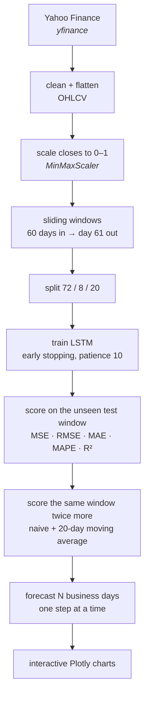
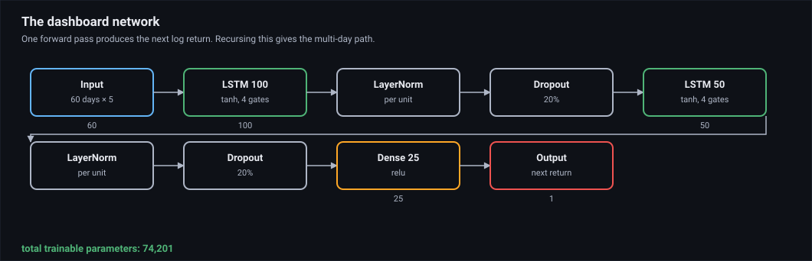
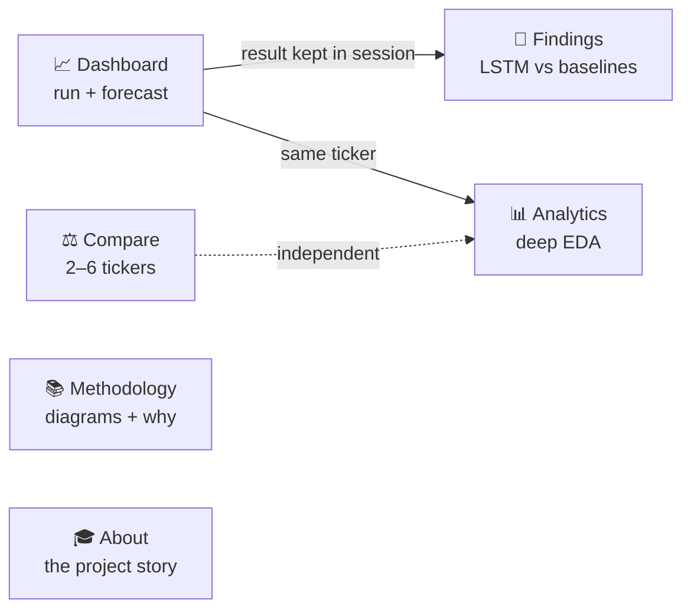
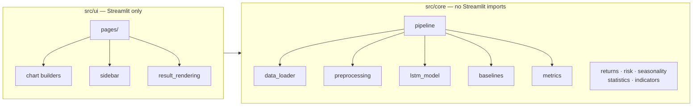

# LSTM Trend

A Streamlit app that downloads a stock's history, trains a small LSTM on the
closing prices, and forecasts the next few business days — then shows the honest
scorecard against two much simpler guesses.

**Live app:** <https://lstm-trend.streamlit.app>

It started as a final year project in 2023 and kept growing. It is a learning
project, not a trading tool; the [limits](#limits) section is not optional
reading.

---

## What it does



You pick a ticker and a range, press **Run analysis**, and get back a market
snapshot, training curves, the test-window fit, a forecast table you can
download, and the same numbers for both baselines.

---

## How it works

Three pictures carry most of it.

### One timeline, three windows

<p align="center">
  
</p>

The test window is data the model never trained on, which is the only reason the
RMSE on the Findings page means anything.

### The network

<p align="center">
  
</p>

Two stacked LSTM layers (100, then 50 units) with dropout after each, a dense
layer, and a single linear output. An LSTM keeps a small internal memory, so it
can hold a pattern from earlier in the window instead of only seeing the last
value — which is the whole reason it suits time series. It only learns patterns
that actually exist in the training data.

### Why the forecast drifts

<p align="center">
  
</p>

Each predicted day is appended to the window and the oldest day drops off, so
the model is soon forecasting from its own guesses. Errors compound — a 5-day
forecast is far more believable than a 90-day one. Dates are business days only.

---

## Pages



| Page | What you get |
| --- | --- |
| 📈 **Dashboard** | Run an analysis, see charts, download the forecast as CSV |
| 📊 **Analytics** | Five lazy tabs: Overview, Returns, Seasonality, Technicals, Risk |
| ⚖️ **Compare** | Normalized prices, correlation, drawdowns, risk-vs-return scatter |
| 🔬 **Findings** | The verdict — did the LSTM actually beat the baselines? |
| 📚 **Methodology** | Pipeline and architecture diagrams, hyperparameters, trade-offs |
| 🎓 **About** | Project background, FAQ, run instructions |

---

## Tech stack

| Piece | Version | Role |
| --- | --- | --- |
| Python | 3.13 | Language |
| Streamlit | 1.61.1 | Web app framework and multipage navigation |
| Keras | 3.15.1 | Model definition and training (Functional API) |
| PyTorch | 2.13.0 | Backend — CUDA GPU when available, CPU otherwise |
| pandas | 3.0.5 | Time series wrangling |
| NumPy | 2.5.1 | Array maths, windowed sequence building |
| scikit-learn | 1.9.0 | MinMaxScaler and the regression metrics |
| scipy | 1.18.0 | KDE, Q–Q plots, moments, ADF test |
| Plotly | 6.9.0 | Every interactive chart |
| yfinance | 1.5.2 | Market data |
| uv | latest | Environment and dependency management |

Versions are pinned in `pyproject.toml` and locked in `uv.lock`.

---

## Architecture

Two layers, one direction of dependency:



`src/core/` has no Streamlit import anywhere, so the analysis logic can be run
and reasoned about on its own. A few patterns worth knowing:

- **Session state carries the result.** `AnalysisResult` lands in
  `st.session_state["analysis"]`, so Findings reads it without retraining.
- **Progress via plain callables.** `ProgressReporterCallback` takes two
  callbacks and knows nothing about Streamlit; `sidebar.py` maps them onto a
  progress bar.
- **Settings are form-gated.** Lookback, horizon, epochs and batch size only
  apply once you press **Apply model settings**. Date pickers apply instantly.
- **Lazy tabs.** Analytics computes a tab when you open it, not before.
- **Cached downloads.** `load_data_cached()` is `st.cache_data(ttl=3600)`, one
  hour, to stay friendly to Yahoo Finance.
- **Device detection.** `training_device()` checks `torch.cuda.is_available()`
  once via `lru_cache` and never recomputes.

---

## Project layout

```
lstm-trend/
├── streamlit_app.py        # entry point: KERAS_BACKEND, st.navigation, footer
├── src/
│   ├── constants.py        # defaults, URLs, plot palette
│   ├── core/               # pure analysis — no Streamlit
│   │   ├── data_loader.py  # yfinance download, MultiIndex flattening
│   │   ├── preprocessing.py# MinMaxScaler, sliding-window sequences
│   │   ├── lstm_model.py   # build, train, evaluate, step-wise forecast
│   │   ├── callbacks.py    # callable-based progress reporting
│   │   ├── pipeline.py     # run_analysis(), AnalysisResult, PipelineError
│   │   ├── baselines.py    # naive + moving-average forecasts
│   │   ├── metrics.py      # MSE / RMSE / MAE / MAPE / R²
│   │   ├── returns.py      # returns, CAGR, trailing periods, 52w position
│   │   ├── risk.py         # Sharpe, Sortino, drawdowns, VaR, CVaR
│   │   ├── seasonality.py  # weekday effects, monthly heatmap, month effects
│   │   ├── statistics.py   # skew/kurtosis, ADF test, autocorrelation
│   │   └── indicators.py   # SMA, EMA, RSI, MACD, Bollinger, crossovers
│   └── ui/                 # Streamlit rendering
│       ├── chart_theme.py  # DARK_THEME, PALETTE, layout(), with_alpha()
│       ├── dashboard_charts.py
│       ├── analytics_charts.py
│       ├── compare_charts.py
│       ├── sidebar.py      # controls, symbol picker, progress UI
│       ├── result_rendering.py
│       └── pages/
│           ├── nav.py      # st.Page objects, the single source of routing
│           ├── dashboard.py · analytics.py · compare.py
│           └── findings.py · methodology.py · about.py
├── docs/                   # SVG figures used by this README
├── .streamlit/config.toml  # dark theme, widget borders, no usage stats
├── pyproject.toml          # metadata, dependencies, pyright settings
├── uv.lock                 # locked versions
├── SECURITY.md             # how to report a vulnerability
├── LICENSE                 # MIT
└── README.md
```

`AGENTS.md`, `streamlitinfolinks.txt` and `knownerrors.txt` are local working
notes and are gitignored on purpose — the last one is the audit log of
type-checker diagnostics and what was done about them.

---

## Running it locally

Everything goes through [uv](https://docs.astral.sh/uv/) — no `pip`, no
`conda`, no global installs.

```bash
git clone git@github.com:c0k0n/lstm-trend.git
cd lstm-trend
uv sync
uv run streamlit run streamlit_app.py
```

Then open <http://localhost:8501>, pick a ticker, and hit **Run analysis**.

- First `uv sync` is slow — PyTorch is a big download.
- The first run trains from scratch; the progress bar keeps you company.
- You need at least `sequence_length + 10` trading days (70 by default);
  shorter ranges fail with a readable error instead of a Keras crash.
- Analytics needs 60 trading days minimum.

### After changing code

```bash
uv format
uv check
```

`uv check` runs the `ty` type checker. Keras, Plotly, scipy and yfinance ship no
type stubs, so `pyproject.toml` sets `[tool.pyright] typeCheckingMode =
"standard"` — that drops the ~250 "unknown type" diagnostics we cannot fix in
our own code while keeping every real error, including
`reportAttributeAccessIssue`.

### GPU

Keras 3 runs on the PyTorch backend, and PyTorch ships CUDA inside its own
wheels. On an NVIDIA machine with working drivers the app picks the GPU up with
no environment variables and no `LD_LIBRARY_PATH` fiddling; the sidebar shows
which device it used. Without a GPU it quietly runs on CPU. The entry point sets
`KERAS_BACKEND=torch` itself, though a value you preset wins.

---

## Deploying to Streamlit Community Cloud

Already live, deployed straight from `main`. To redo it: connect the repo at
<https://share.streamlit.io> with entrypoint `streamlit_app.py`, then open
**Advanced settings** and set Python to **3.13** — Community Cloud defaults to
3.12 and this project needs 3.13+. The first build is slow because of PyTorch.

Community Cloud prefers `uv.lock` over `pyproject.toml` and `requirements.txt`,
so the cloud installs exactly what you run locally. On the free tier the app
sleeps when idle and the next visitor waits for it to wake; that is normal.

---

## Configuration

Everything lives in the sidebar.

| Setting | What it does | Range | Default |
| --- | --- | --- | --- |
| Ticker | Symbol to analyse, or any custom one | — | `AAPL` |
| Start / End | Historical range | — | 2020 → today |
| Lookback window | Days the model sees per step | 10–120 | 60 |
| Forecast horizon | Business days ahead (preset or custom) | 5–90 | 15 |
| Epochs | Training passes | 1–100 | 50 |
| Batch size | Samples per step | 8–128 | 32 |

Fixed settings sit in `src/constants.py`: 80/20 split, 10% validation, 100 and
50 LSTM units, 25 dense units, 0.2 dropout, patience 10, seed 42, 20-day
moving-average window, and the colour palette.

Deep links work too —
`?ticker=MSFT&start=2024-01-01&end=2025-01-01&horizon=30` prefills the sidebar.
After a run the current settings are written back to the URL so you can
bookmark an exact analysis. `horizon` takes a preset (5, 15, 30) or any integer
from 5 to 90.

---

## Limits

- **Not investment advice.** Markets move on news, earnings and policy, none of
  which is in a price series. One LSTM on closing prices is a toy next to what
  professional shops run.
- **Only the close is used.** No volume, no indicators, no fundamentals. A
  deliberate simplification that leaves a lot on the table.
- **Forecasts drift.** Errors compound with horizon — see the cone above.
- **R² flatters trending stocks.** Easy to score well on a strong trend, brutal
  on a choppy one. That is exactly why the baselines are shown beside it.
- **Nothing is persisted.** Every run retrains from scratch, and the free tier
  is memory-limited, so long lookbacks get slow.

---

## Where next

- Cache or persist trained models so repeat visits skip retraining.
- Feed the model volume, indicators, or returns instead of raw prices.
- Let users choose the target column and the architecture.
- Confidence bands around the forecast.
- A real backtest view: how would this have done on past windows?

---

## Security

See [SECURITY.md](SECURITY.md). Please don't open a public issue for a
vulnerability — report it privately instead.

## License

MIT — see [LICENSE](LICENSE). Use it freely; just don't blame me if the
prediction says "up" and the stock goes down.
